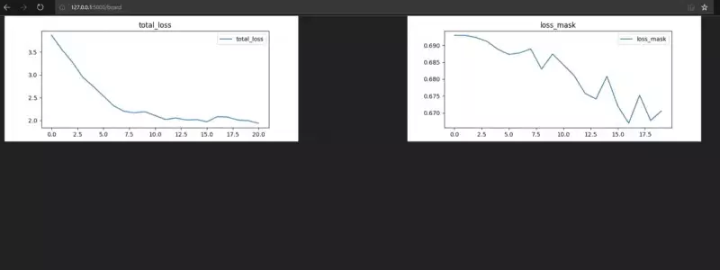

## Metrics dashboard


Merging metrics



### Build:
```
docker-compose build
```

### Run:
```
docker-compose up
```

### GET

Navigate to http://127.0.0.1:5000/board

### POST
```
python3 client.py
```
